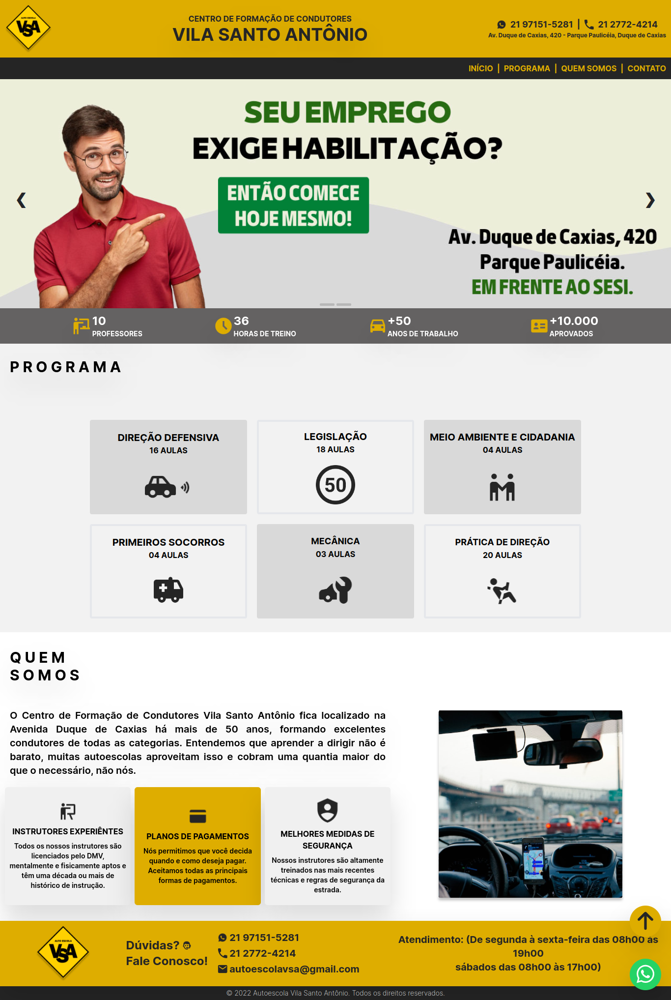

<h1 align="center"> Website - Autoescola</h1>

Projeto desenvolvido para Vila Santo Antônio com Tailwind e 100% responsivo.

  <a href="#-tecnologias">Tecnologias</a>&nbsp;&nbsp;&nbsp;|&nbsp;&nbsp;&nbsp;
  <a href="#-projeto">Projeto</a>&nbsp;&nbsp;&nbsp;|&nbsp;&nbsp;&nbsp;
  <a href="#-layout">Layout</a>&nbsp;&nbsp;&nbsp;|&nbsp;&nbsp;&nbsp;
  <a href="#memo-licença">Licença</a>

  

  

 

---

 

## 💻 Tecnologias

Esse projeto foi desenvolvido com as seguintes tecnologias:

- Tailwind
- JavaScript

 

## 📚 Projeto

A webpage foi desenvolvida para um cliente de forma gratuita com objetivo de aprender mais sobre a tecnologia Tailwind.

 

## 🔖 Layout

Você pode visualizar o layout do projeto através [desse link](https://aevsa.netlify.app).

 

## 📄 Licença

Esse projeto está sob a licença MIT.

